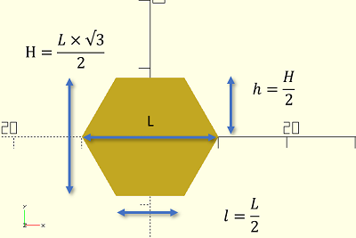
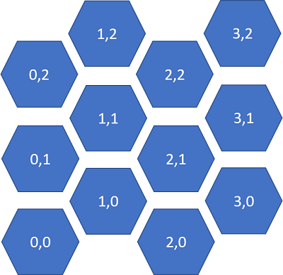

# Card-Game-Organizer
Card Game Organizer like Dominion, thunderstone, Magic Gathering , etc ?

--- 
title : HoneyComb
page_type : article
# I talked about creating a honneycomb in Boolean operations. the goal is to build with 3D printer many objet as box to save material 
---


Table of Contents
=================
1 Honeycomwall
1.1 [Hexagone](#hex)
1.2 [Map](#map)
1.3 [Wall](#wall)


## Create a simple Hexagone <a name="hex"></a>

With only the diameter of the hexagone , we can dranw it 

 


``` OPENSCAD
    
    // size.z  # Thickness of hex

    L = diameter;
    l = L/2;
    
    h = Sin(60) * L/2
    $$ h = { \sqrt{3} \over 2} $$
 

    cylinder (r=l,h=size.z,$fn=6);
``` 


## Create a map with hexagons <a name="map"></a>





We start  by define the numbers of hexagonsand the spacing between each hexagon :
* nb_x => number of coluns.
* nb_y => number of row.
* spacing => 10% of the diameter.

``` OPENSCAD
nb_x = 4;
nb_y = 3;   

spacing = L * 0,10;

```

now we can make a loop to draw each hexagone and set DX and DY to translate the hex in each loop.

``` OPENSCAD
for (i = [0:nb_x -1])
    for (j = [0:nb_y -1]) {
        DX= (i * ((3 * l/2) + e));
        DY = (j * (2*h+e)  + (i%2 * (h+(e/2))));
        translate ([DX,DY,0])
        cylinder (r=l,h=depth,$fn=6);
    }
```

|(i,j)|DX|DY|
|----|----|----|
|(0,0)|(3*l/2+e)*0|0|
|(1,0)|(3*l/2+e)*0|h+e|
|(2,0)|(3*l/2+e)*0|0|
|(3,0)|(3*l/2+e)*0|h+e|


## Create a wall with a map <a name="wall"></a>
