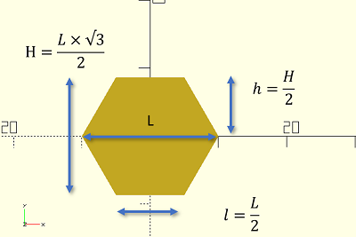

--- 
title : HoneyComb
page_type : article
# I talked about creating a honneycomb in Boolean operations. the goal is to build with 3D printer many objet as box to save material 
---


Table of Contents
=================
* [Hexagone](#hex)
* [Map](#map)
* [Wall](#map)


## Create a simple Hexagone <a name="hex"></a>

With only the diameter of the hexagone , we can dranw it 

 {width:50px;}


``` OPENSCAD
    
    // size.z  # Thickness of hex

    L = diameter;
    l = L/2;
 

    cylinder (r=l,h=size.z,$fn=6);
``` 

## Create a map with hexagons 


